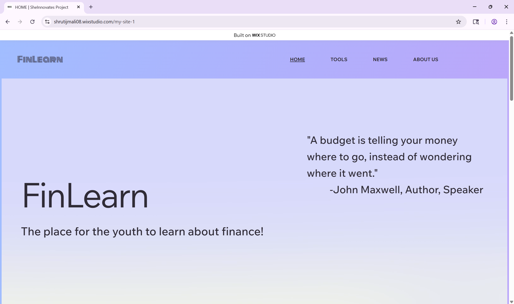
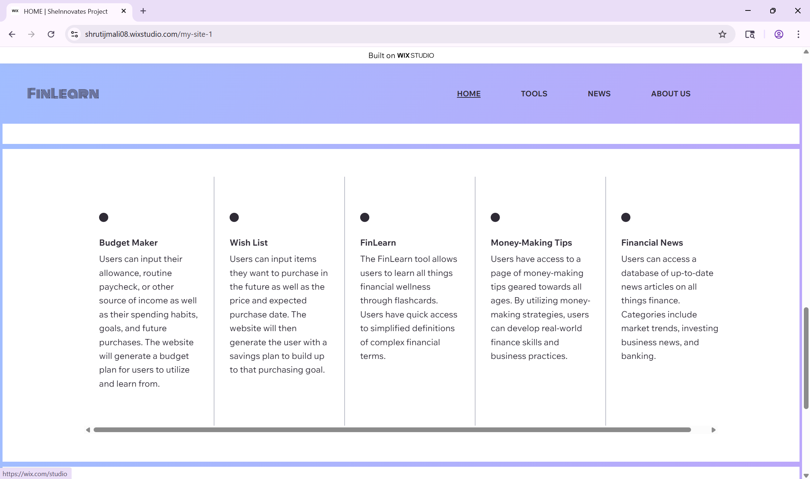
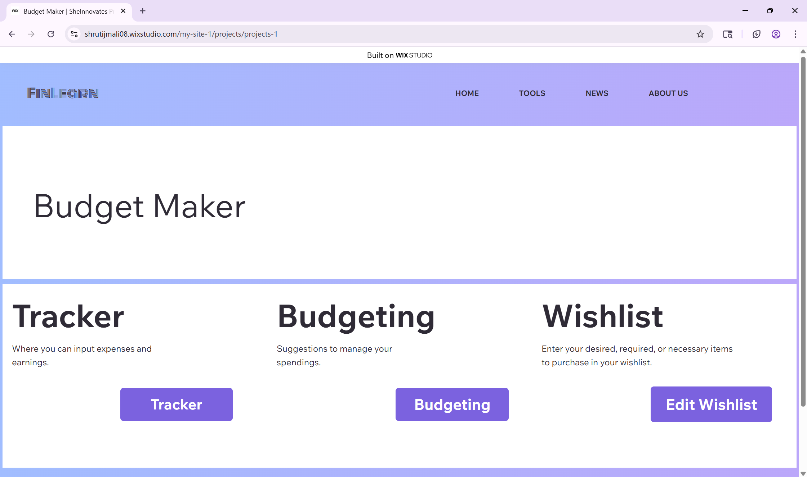
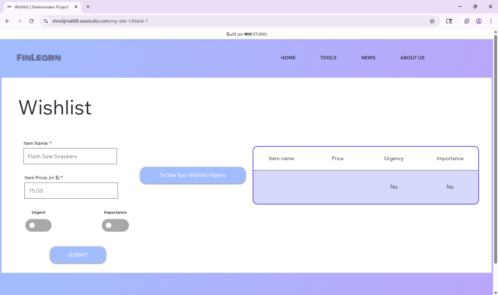
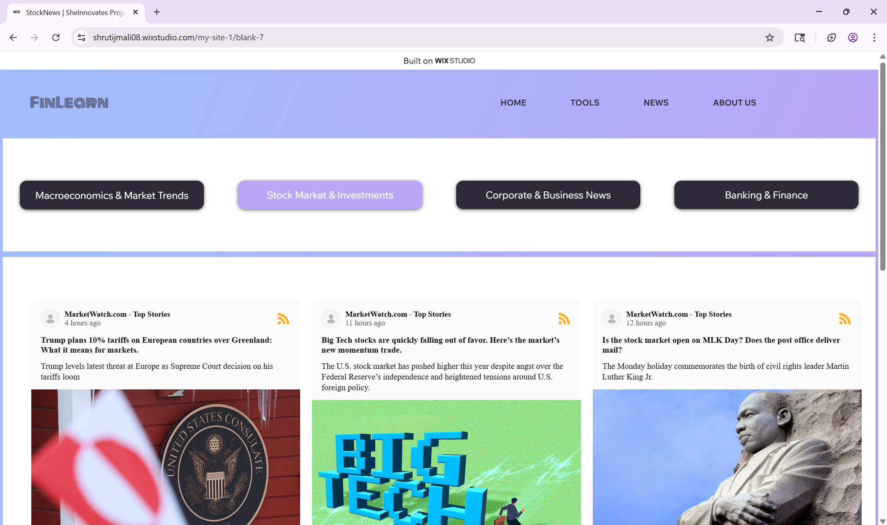

# 📊 FinLearn: Financial Literacy for the Next Generation
    🏆 2nd Place Winner at the She Innovates Hackathon (Sponsored by PNC Bank)
**Role: Product Lead | UI Lead**

FinLearn is a scalable financial literacy platform designed to bridge the education gap for teenagers and young adults. Developed in a high-pressure **30-hour sprint**, the platform transforms complex financial jargon into a gamified, digestible experience to help users navigate savings, budgeting, and debt management.

### 🔗 Project Link
Live Prototype: [FinLearn](https://shrutijmali08.wixstudio.com/my-site-1) (or https://shrutijmali08.wixstudio.com/my-site-1)

## 🚀 The Challenge
Financial instability often stems from a lack of foundational knowledge during formative years. Our team was challenged to build a solution that reduces the barrier of entry for "financial beginners" while maintaining high engagement under a strict 30-hour deadline.

### 🛠️ Tech Stack
- **Platform**: Wix Studio (Rapid Prototyping & Deployment)
- **Styling**: Custom CSS (For high-fidelity UI/UX and brand consistency)
- **Data**: Content Management System (Wix Studio built-in)
- **Integrations**: RSS Financial News Feed

## 📸 Interface Gallery 
(Click on images to enlarge)
<table>
    <tr>
        <td>
             
        </td>
        <td>    
            
        </td>
    </tr>
    <tr>
        <td>
            
        </td>
        <td>
            
        </td>
    </tr>
    <tr>
        <td>
            
        </td>
        <td>
            
        </td>
    </tr>
</table>

## ✨ Key Features
- **Real-Time Expense Tracker**: A simplified ledger for users to log income (allowances, part-time jobs) and visualize spending habits.

- **Personalized Wishlist Tool**: An interactive UX feature that connects daily budgeting to long-term goals, showing users exactly how their spending impacts their big purchase dreams.

- **Modular Learning Framework**: Lessons on debt management and market trends broken down into bite-sized modules to prevent cognitive overload.

- **Accessible UI**: High-contrast design and intuitive navigation specifically tailored for a teen demographic.

## 🚧 Project Status: Hackathon Proof-of-Concept
As this platform was developed within a 30-hour competitive sprint, it serves as a functional UI/UX prototype rather than a fully deployed production application.

- **State Management**: Core features like the Wishlist and Expense Tracker are implemented as front-end simulations. While the UI logic is present, persistent data storage (Database) was out of scope for the initial sprint.

- **Database Architecture**: The project includes a lightweight **Content Management System (CMS)**, the build-in databases collections, schema design intended for future integration with a live backend.

- **Purpose**: The primary goal was to demonstrate Information Architecture, User Flow, and Visual Fidelity to stakeholders within the time limit.

## 🧠 Technical & Design Insights
#### ⚡ Rapid Feature Prioritization
As the Product & UI Lead, I managed the development cycle by utilizing a **MoSCoW (Must-have, Should-have, Could-have, Won't-have)** framework. This allowed us to pivot from a broad concept to a functional MVP (Minimum Viable Product) that focused on the most "painful" user problems first.

#### 🎨 Design-to-Dev Efficiency
To meet the 30-hour deadline without sacrificing visual quality, I implemented a **modular design system** in Wix Studio including **Custom CSS**. 

#### 📈 HCI-Driven IA
The information architecture was designed using **User-Centered Design (UCD)** principles. We simplified "bank-speak" into actionable steps, ensuring that users with zero financial background could navigate the platform without feeling intimidated.

#### 🏆 Recognition
- **2nd Place Overall**: Awarded by a panel of judges from PNC Bank.

- **Criteria**: Recognized for excellence in usability, solution quality, and technical execution within the competition timeframe.

## 📔Contact Me
I’m a UI/UX Engineer & HCI Researcher passionate about bridging the gap between robust engineering and intentional design.

- View My Full Portfolio: https://github.com/shruti-mali08/shruti-portfolio 🚀

- LinkedIn: [Shruti Mali](https://www.linkedin.com/in/shruti-mali-d130613day22/) 💼

- Email: shrutijmali08@gmail.com 📧
